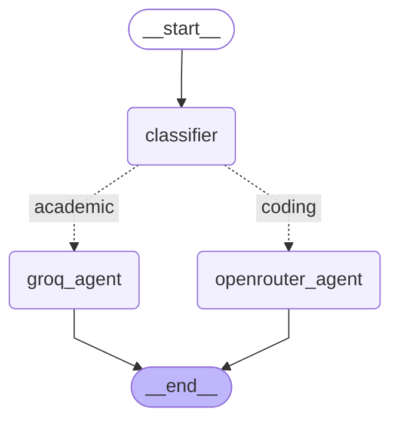

# LangGraph StateGraph Visualization

## Architecture Diagram

## How to View

1. Copy the mermaid code above
2. Go to: https://mermaid.live
3. Paste and view the interactive diagram

## Graph Description

- START: Entry point for all queries
- Classifier Node: Analyzes query type
- Groq Agent Node: Processes academic queries
- OpenRouter Agent Node: Processes coding queries
- END: Exit point after processing
